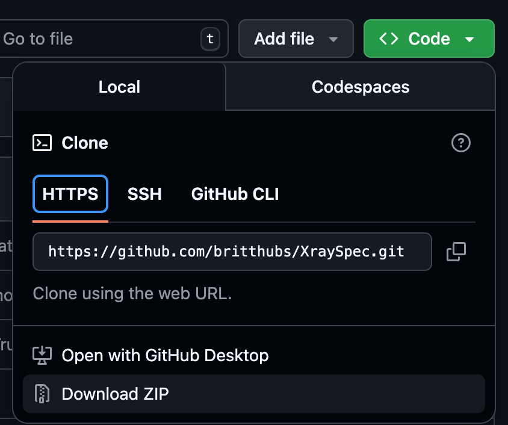

# Handheld XRF spectra in python

## Table of contents
- [Description](#description)
- [Download the software (Windows only)](#download-the-software-windows-only)
- [Repository download (macOS and Linux option, Windows instructions also included)](#repository-download-macos-and-linux-option-windows-instructions-also-included)
- [Contributors and inspiration](#contributors-and-inspiration)

## Description

XraySpec is a Python-based program designed for visualising XRF spectra based on the configuration of the spectrum in PyMCA. This is written specifically for CSV files obtained with a handheld XRF instrument. (Only tested on data from the Bruker S1 Titan model 800, other handheld XRF instruments might not be compatible.)

## Download the software (Windows only) 
PRE-RELEASE ONLY

Looking to try out **XraySpec**?

[Download XraySpec.exe](https://github.com/britthubs/XraySpec/releases/download/v0.1.3-beta/XraySpec.exe)

No installation required, just download and run!

## Repository download (macOS and Linux option, Windows instructions also included)
For macOS and Linux users, there is no packaged software available. However, the files in this repository can be downloaded directly, and can run on these systems **given python is installed**. With the help of some terminal commands, and if preferred an IDE, the program can run too.

The following steps should also be followed in case you want to make a pull request, are interested in tweaking the source code for other reasons, or if you are a Windows user that prefers to have the repository instead of the single .exe file.

To download the repository to your device, either use `Download ZIP` to download a zip-file of the repository, or use other methods like `git clone`, whichever you are more comfortable with.



As the script is based on some specific packages and dependencies, it is recommended to activate a python environment and install the packages. The steps starting from here are different for macOS and Linux users compared to Windows users.

### macOS and Linux 

Make sure python is installed before following these steps, visit [this website](https://www.geeksforgeeks.org/how-to-install-python-on-mac/) for information on how to install python on macOS, and [this website](https://www.geeksforgeeks.org/how-to-install-python-on-linux/) for Linux.

Open the terminal and navigate to where you want your environment folder to be located. For information on navigating your system through the terminal, [click here](https://www.howtogeek.com/666127/how-to-use-the-cd-command-on-linux/). The standard use will be enough information. 

In this location, type the following command in the terminal:

```python -m venv xSpecEnv```

Copy the file path of the folder that it has created and activate the environment. To do so, you need a command that has this path, for example in case the folder path looks like Users/burrito/environments/xSpecEnv, you can activate the environment with the **source** command and by adding **/bin/activate** to the end of the path. This example would be:

```source Users/burrito/environments/xSpecEnv/bin/activate```

The packages can now be installed as the environment is activated, to do so, in the terminal write: 

```pip install matplotlib numpy nicegui pywebview pymca5 pandas```

Your environment is now ready and activated. Find the zipped repository you downloaded and unzip it. You can place the folder where you prefer.

To run the python file, you can either open GUI.py and run it with a preferred IDE, or navigate to the repository and in terminal write:

```python GUI.py```

Make sure the environment is always activated before running the python file, no need to install the packages every time, only this command is used to activate (depending on the file path):

```source Users/burrito/environments/xSpecEnv/bin/activate```

to deactivate the environment, in terminal write:

```deactivate```

### Windows
Make sure python is installed before following these steps, visit [this website](https://www.geeksforgeeks.org/how-to-install-python-on-windows/) for information on how to install python.

Open the Command Prompt (for PowerShell, the following instructions may not work), and navigate to where you want your environment folder to be located. For information on navigating your system through the Command Prompt, [click here](https://www.geeksforgeeks.org/techtips/change-directories-in-command-prompt/).

In this location, type the following command in the terminal:

```python -m venv xSpecEnv```

Copy the file path of the folder that it has created and activate the environment. To do so, you need a command that has this path, for example in case the folder path looks like C:\Users\Burrito\environments\xSpecEnv, you can activate the environment with the by adding **\Scripts\activate.bat** to the end of the path. This example would be:

```C:\Users\Burrito\environments\xSpecEnv\Scripts\activate.bat```

The packages can now be installed as the environment is activated, to do so, in the terminal write: 

```pip install matplotlib numpy nicegui pywebview pymca5 pandas```

Your environment is now ready and activated. Find the zipped repository you downloaded and unzip it. You can place the folder where you prefer.

To run the python file, you can either open GUI.py and run it with a preffered IDE, or navigate to the repository and in terminal write:

```python GUI.py```

Make sure the environment is always activated before running the python file, no need to install the packages every time, only this command is used to activate (depending on the filepath):

```C:\Users\Burrito\environments\xSpecEnv\Scripts\activate.bat```

to deactivate the environment, in terminal write:

```deactivate```

## Contributors and inspiration

Author: @britthubs

Inspiration reading cfg files and adding elements as annotation: [Xims](https://github.com/PieterTack/Xims) by [@PieterTack](https://github.com/PieterTack)

